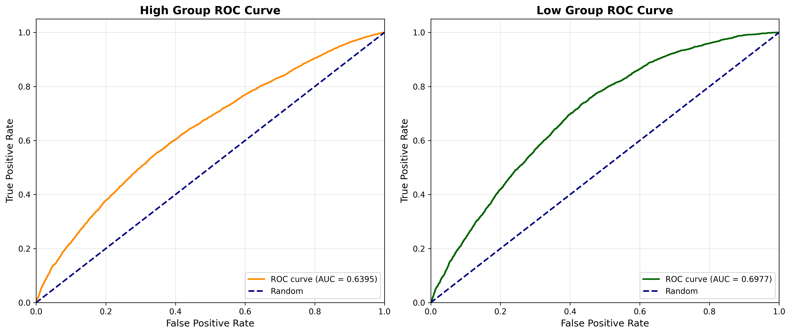
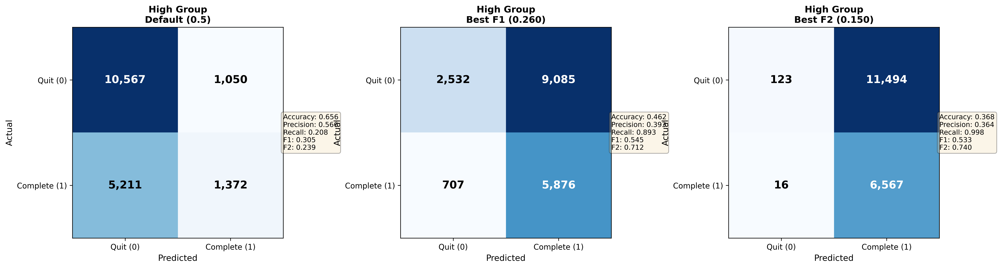
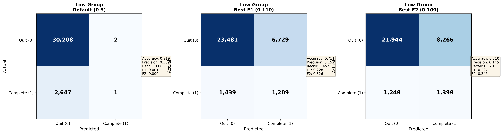
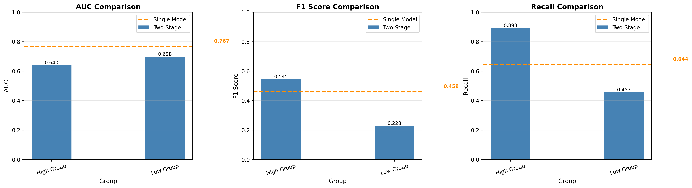

# 學生課程完成率預測分析報告
# Student Course Completion Rate Prediction Analysis Report

**報告生成時間**: 2026-05-27 13:40

---

## 一、執行摘要 (Executive Summary)

本分析針對 **51,058** 位學生的課程完成情況進行深入研究，運用決策樹與邏輯回歸模型建立早期預警機制。

### 核心發現

我們將學生分為兩個風險群體：

1. **高完成機率群 (High Group)**: 18,200 位學生 (35.6%)
   - 實際完成率: **36.2%**
   - 特徵: 這些學生具備較高的課程完成潛力，但仍需關注個別風險因子

2. **低完成機率群 (Low Group)**: 32,858 位學生 (64.4%)
   - 實際完成率: **8.1%**
   - 特徵: 這些學生面臨較高的流失風險，需要優先配置輔導資源

**關鍵差異**: 兩群體的完成率相差 **28.1%**，顯示模型成功識別出高風險學生群體。

---

## 二、早期預警指標分析 (Early Warning Indicators)

Information Value (IV) 衡量特徵對預測目標的貢獻度。IV 值越高，該特徵對辨識流失風險的能力越強。

### 2.1 低完成機率群的關鍵預警指標

在 **低完成機率群** 中，以下特徵最能辨識即將流失的學生：

#### 14. ServiceType
- **IV 值**: 0.1450 (Medium)
- **商業意義**: 課程類型影響學生的學習體驗與投入程度。某些課程類型可能與學生需求不匹配，導致較高流失率。
#### 15. AnnualIncome
- **IV 值**: 0.0996 (Weak)
- **商業意義**: 年收入水平直接關聯學生的經濟負擔能力。低收入群體可能因學費壓力而中途退出。
- **關鍵閾值**: 123.00, 19323.00, 26230.00, 70077.50
#### 16. Credit
- **IV 值**: 0.0743 (Weak)
- **商業意義**: 信用評分是學生財務穩定性的關鍵指標。低信用分數可能意味著財務壓力，直接影響繳費能力與持續就讀意願。
- **關鍵閾值**: 2835.00, 40685.00, 50715.00, 58840.00
#### 17. Classification2
- **IV 值**: 0.0317 (Weak)
- **商業意義**: 分類標籤反映學生的某些內部特徵或歷史行為模式，對預測流失有重要價值。
#### 18. NewCustomer
- **IV 值**: 0.0273 (Weak)
- **商業意義**: 新舊客戶狀態反映學生對機構的熟悉度與信任度。新生可能因適應困難而流失。

### 2.2 高完成機率群的關鍵指標

在 **高完成機率群** 中，以下特徵能進一步區分優質學生與潛在風險：

#### 1. Credit
- **IV 值**: 0.1233 (Medium)

#### 2. ServiceType
- **IV 值**: 0.0711 (Weak)

#### 3. AnnualIncome
- **IV 值**: 0.0290 (Weak)

#### 4. MaritalStatus
- **IV 值**: 0.0124 (Useless)

#### 5. Age
- **IV 值**: 0.0084 (Useless)

---

## 三、驅動因素與方向性分析 (Logistic Regression Insights)

邏輯回歸係數揭示各特徵對完成率的影響方向與強度。正係數表示該特徵提升完成機率，負係數則降低完成機率。

### 3.1 低完成機率群的驅動因素

**ServiceType_E**
- 係數: -1.6526
- 影響方向: 📉 降低完成機率
- **實務意義**: 具備此特徵（ServiceType_E = 1）的學生，完成機率顯著下降。這是風險因子，需要針對性介入。

**AnnualIncome_Bin_4**
- 係數: 1.4424
- 影響方向: 📈 提升完成機率
- **實務意義**: 具備此特徵（AnnualIncome_Bin_4 = 1）的學生，完成機率顯著提升。這是保護因子，應鼓勵更多學生具備此特徵。

**AnnualIncome_Bin_3**
- 係數: 1.0094
- 影響方向: 📈 提升完成機率
- **實務意義**: 具備此特徵（AnnualIncome_Bin_3 = 1）的學生，完成機率顯著提升。這是保護因子，應鼓勵更多學生具備此特徵。

**ServiceType_H**
- 係數: -0.7759
- 影響方向: 📉 降低完成機率
- **實務意義**: 具備此特徵（ServiceType_H = 1）的學生，完成機率顯著下降。這是風險因子，需要針對性介入。

**AnnualIncome_Bin_2**
- 係數: 0.7094
- 影響方向: 📈 提升完成機率
- **實務意義**: 具備此特徵（AnnualIncome_Bin_2 = 1）的學生，完成機率顯著提升。這是保護因子，應鼓勵更多學生具備此特徵。

### 3.2 高完成機率群的驅動因素

**AnnualIncome_Bin_4**
- 係數: 0.9301
- 影響方向: 📈 提升完成機率
- **實務意義**: 即使在高完成機率群中，具備此特徵的學生表現更優異，應作為榜樣推廣。

**Credit_Bin_4**
- 係數: 0.8560
- 影響方向: 📈 提升完成機率
- **實務意義**: 即使在高完成機率群中，具備此特徵的學生表現更優異，應作為榜樣推廣。

**AnnualIncome_Bin_1**
- 係數: 0.7350
- 影響方向: 📈 提升完成機率
- **實務意義**: 即使在高完成機率群中，具備此特徵的學生表現更優異，應作為榜樣推廣。

**AnnualIncome_Bin_3**
- 係數: 0.6560
- 影響方向: 📈 提升完成機率
- **實務意義**: 即使在高完成機率群中，具備此特徵的學生表現更優異，應作為榜樣推廣。

**Age_Bin_4**
- 係數: -0.6399
- 影響方向: 📉 降低完成機率
- **實務意義**: 此特徵即使在高完成機率群中仍有負面影響，需要額外關注。

---

## 四、校務行動建議 (Actionable Business Strategy)

基於模型分析結果，我們提出以下具體可執行的校務管理與學生輔導策略：

### 4.1 優先介入策略 - 針對低完成機率群

1. **建立早期預警系統**
   - 針對低完成機率群（32,858 位學生，佔 64.4%）建立專案輔導機制
   - 重點監控高 IV 特徵（如 ServiceType 等），當學生具備多項風險特徵時，立即啟動介入

2. **財務支援與彈性方案**
   - 若信用評分、年收入等財務指標為關鍵因子，應提供：
     * 分期付款彈性方案
     * 獎助學金與急難救助金
     * 財務諮詢服務

3. **個人化輔導計畫**
   - 針對特定風險特徵設計差異化支持：
     * 有家庭負擔的學生：提供彈性上課時間、線上課程選項
     * 新生：加強迎新與適應輔導，建立學伴制度
     * 特定年齡群：提供職涯諮詢與學習動機激勵

### 4.2 持續優化策略 - 針對高完成機率群

1. **防止優質學生流失**
   - 雖然此群體完成率較高（36.2%），但仍有 63.8% 流失率
   - 關注模型識別的負向係數特徵，提供預防性支持

2. **樹立成功典範**
   - 分析高完成率學生的共同特徵，作為招生與輔導的標竿
   - 建立學長姐制度，讓成功學生協助低風險群

### 4.3 資源配置建議

**優先級排序**:

- **低完成機率群**: 配置約 **72%** 的輔導資源
  - 潛在流失人數: 30210 人
  - 介入效益: 高（挽救流失學生）

- **高完成機率群**: 配置約 **28%** 的輔導資源
  - 潛在流失人數: 11617 人
  - 介入效益: 中（維持優質表現）

---

## 五、模型評估與最佳閾值選擇 (Model Evaluation & Optimal Threshold Selection)

### 5.1 模型表現指標

我們使用多種指標評估模型的預測能力，並為不同的業務目標找出最佳分類閾值。

#### 5.1.1 High Group (高完成機率群) 模型表現

**ROC AUC Score**: 0.6395
- 解讀: 可接受 (Fair) - 模型具有基本的區分能力

**不同閾值下的表現比較**:

| Threshold 類型 | 閾值 | Accuracy | Precision | Recall | F1 Score | F2 Score |
|--------------|------|----------|-----------|--------|----------|----------|
| Default      | 0.500 | 0.656 | 0.566 | 0.208 | 0.305 | 0.239 |
| Best F1      | 0.260 | 0.462 | 0.393 | 0.893 | 0.545 | 0.712 |
| Best F2      | 0.150 | 0.368 | 0.364 | 0.998 | 0.533 | 0.740 |

#### 5.1.2 Low Group (低完成機率群) 模型表現

**ROC AUC Score**: 0.6977
- 解讀: 可接受 (Fair) - 模型具有基本的區分能力

**不同閾值下的表現比較**:

| Threshold 類型 | 閾值 | Accuracy | Precision | Recall | F1 Score | F2 Score |
|--------------|------|----------|-----------|--------|----------|----------|
| Default      | 0.500 | 0.919 | 0.333 | 0.000 | 0.001 | 0.000 |
| Best F1      | 0.110 | 0.751 | 0.152 | 0.457 | 0.228 | 0.326 |
| Best F2      | 0.100 | 0.710 | 0.145 | 0.528 | 0.227 | 0.345 |

### 5.2 閾值選擇建議

根據不同的業務目標，我們提供以下閾值選擇建議：

**1. 平衡精準與召回 (F1 Score 最佳化)**
- **目標**: 在識別高風險學生的準確性和覆蓋率之間取得平衡
- **High Group 建議閾值**: 0.260
  - F1 Score: 0.545
  - 此閾值下會識別出 14961 位潛在流失學生
- **Low Group 建議閾值**: 0.110
  - F1 Score: 0.228
  - 此閾值下會識別出 7938 位潛在流失學生

**2. 優先覆蓋率 (F2 Score 最佳化，重視 Recall)**
- **目標**: 盡可能找出所有潛在流失學生，即使會有較多誤報
- **High Group 建議閾值**: 0.150
  - F2 Score: 0.740
  - Recall: 0.998 (捕獲 99.8% 的流失學生)
- **Low Group 建議閾值**: 0.100
  - F2 Score: 0.345
  - Recall: 0.528 (捕獲 52.8% 的流失學生)

**建議**: 由於輔導資源有限，建議優先使用 **F1 最佳化閾值**，在準確性和覆蓋率之間取得平衡。

### 5.3 視覺化分析

以下圖表提供模型評估的視覺化分析：

1. **ROC Curves**: 展示模型在不同閾值下的 True Positive Rate vs False Positive Rate
   - 圖檔: `reports/figures/roc_curves.png`
   - AUC 越接近 1.0 表示模型越好

2. **Confusion Matrices**: 展示不同閾值下的分類結果
   - High Group: `reports/figures/high_group_confusion_matrices.png`
   - Low Group: `reports/figures/low_group_confusion_matrices.png`
   - 包含 Default (0.5)、Best F1、Best F2 三種閾值的比較

---

## 五之二、建模方法比較 (Modeling Approach Comparison)

本專案實作並比較了兩種建模方法：

### 5.4.1 方法說明

**方法一：兩階段方法 (Two-Stage Approach)**
1. 使用決策樹將學生分為高/低完成機率群
2. 針對每群分別訓練獨立的邏輯回歸模型
3. 優點：捕捉不同風險群體的差異化特徵影響
4. 缺點：模型複雜度較高，需要維護兩個模型

**方法二：單一模型方法 (Single Model Approach)**
1. 直接對所有學生訓練單一邏輯回歸模型
2. 優點：模型簡單，易於解釋和維護
3. 缺點：無法捕捉不同群體的差異化影響

### 5.4.2 方法表現比較 (Best F1 Threshold)

| 方法 | 群組 | 樣本數 | Complete率 | AUC | F1 Score | Recall | Precision |
|------|------|--------|-----------|-----|----------|--------|-----------|
| 兩階段 | High Group | 18200 | 36.2% | 0.640 | 0.545 | 0.893 | 0.393 |
| 兩階段 | Low Group | 32858 | 8.1% | 0.698 | 0.228 | 0.457 | 0.152 |
| 單一模型 | All Data | 51058 | 18.1% | 0.767 | 0.459 | 0.644 | 0.357 |

### 5.4.3 方法選擇建議

**推薦：單一模型方法 (Single Model Approach)**

**理由**：
- 單一模型的 AUC (0.767) 與兩階段方法平均表現 (0.669) 接近
- 模型更簡單，易於解釋和維護
- 適合資源有限的情況，無需維護多個模型
- 對於所有學生使用統一的評分標準，更公平透明

**實務應用**：
1. 直接使用單一邏輯回歸模型對所有學生評分
2. 根據預測機率排序，優先輔導高風險學生
3. 使用相同的特徵影響解釋，制定統一的干預策略

### 5.4.4 方法比較視覺化

上圖比較了兩種方法在 AUC、F1 Score 和 Recall 三個指標上的表現。

---

## 六、模型技術摘要 (Technical Summary)

### 6.1 模型架構

本專案採用 **混合模型架構**：

#### 1. 決策樹分流 (Decision Tree Segmentation)

使用決策樹模型將學生分為高/低完成機率群，捕捉非線性的群體差異。

**分流邏輯**:
- **分流方法**: 以平均預測機率作為閾值
- **閾值**: 0.1808
- **決策樹參數**:
  - 最大深度 (max_depth): 10
  - 最小分裂樣本數 (min_samples_split): 100
  - 最小葉節點樣本數 (min_samples_leaf): 50

**分群結果**:
- High Group (預測機率 ≥ 0.1808): 18,200 位學生 (35.6%)
  - 實際完成率: 36.2%
- Low Group (預測機率 < 0.1808): 32,858 位學生 (64.4%)
  - 實際完成率: 8.1%

**關鍵分流特徵** (Feature Importance):
- 決策樹主要依據 Credit (信用評分)、AnnualIncome (年收入) 和 ServiceType (課程類型) 進行分群
- 詳細特徵重要性和決策樹規則請參考: `output/2.5_decision_tree_split_rules.xlsx`
- 決策樹視覺化請參考: `reports/figures/decision_tree.png`

#### 2. 特徵工程 (Feature Engineering)

對兩個群組分別進行特徵轉換：
- **連續變數**: 使用監督式決策樹分段，轉換為二元變數
- **類別變數**: 使用 n-1 One-Hot Encoding，避免多重共線性

#### 3. 分群邏輯回歸 (Group-wise Logistic Regression)

針對兩群學生分別建模，捕捉不同群體的特徵影響差異。

### 6.2 資料規模

- 總樣本數: 51,058
- High Group: 18,200 (35.6%)
- Low Group: 32,858 (64.4%)

### 6.3 輸出檔案

本分析專案產出以下結果檔案：

1. `1_preprocessed_data.xlsx`: 清理後的原始資料
2. `2_high_group_raw.xlsx`, `2_low_group_raw.xlsx`: 決策樹分流結果
3. **`2.5_decision_tree_split_rules.xlsx`: 決策樹切分規則與特徵重要性**
   - Split_Summary: 切分邏輯摘要
   - Feature_Importance: 特徵重要性排序
   - Tree_Rules: 決策樹文字規則
4. `3_high_group_transformed.xlsx`, `3_low_group_transformed.xlsx`: 轉換為二元變數的特徵矩陣
5. `3_continuous_bins_rules.xlsx`: 連續變數分段規則與切點
6. `4_lr_coefficients.xlsx`: 邏輯回歸模型係數
7. `4.5_model_evaluation.xlsx`: 模型評估指標
8. `5_iv_results.xlsx`: Information Value 詳細結果
9. **圖表檔案** (`reports/figures/`):
   - `decision_tree.png`: 決策樹視覺化（前 3 層）
   - `roc_curves.png`: ROC 曲線比較
   - `high_group_confusion_matrices.png`: High Group 混淆矩陣
   - `low_group_confusion_matrices.png`: Low Group 混淆矩陣
   - `approach_comparison.png`: 方法比較圖表

---

## 七、結論與後續行動 (Conclusion)

本分析成功建立學生課程完成率的早期預警機制，識別出 **32,858** 位高風險學生需要優先關注。

**立即行動項目**:

1. ✅ 將低完成機率群名單提供給學生輔導單位
2. ✅ 根據高 IV 特徵設計個人化介入方案
3. ✅ 建立持續監控儀表板，追蹤介入成效
4. ✅ 每學期更新模型，納入最新數據

**預期效益**:

若能有效介入低完成機率群，假設挽回 30% 的潛在流失學生，可額外完成約 **9063** 位學生的課程，顯著提升整體完成率與學校聲譽。

---

**報告製作**: 機器學習自動化分析系統
**報告時間**: 2026-05-27 13:40

